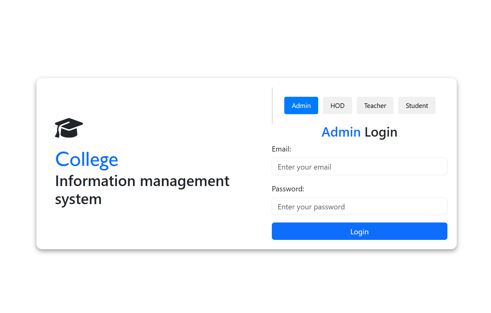

# CAS

A web application built with **Angular 18**.

---

## 🚀 Development

Start the development server:

ng serve

Visit: http://localhost:4200/  
The app reloads automatically when source files change.

---

## 🛠️ Build

Build the project for production:

ng build

Output will be saved in the dist/ folder.

---

## 🧪 Testing

Run unit tests:

ng test

---

## ℹ️ Help

Angular CLI help:

ng help

More info: https://angular.dev/tools/cli

---

## 🗄️ Database

This project uses a **MySQL** database.  
The SQL dump is located at:

database/cas2.sql

### 🔄 How to Import:

1. Open MySQL Workbench (or any MySQL client)
2. Connect to your local MySQL server
3. Open a new SQL tab
4. Run:

SOURCE path/to/database/cas2.sql;

(Replace `path/to` with the actual full path on your system)

Or, use the Import option in MySQL Workbench to restore the database file.

✅ Make sure MySQL server is running before importing.
